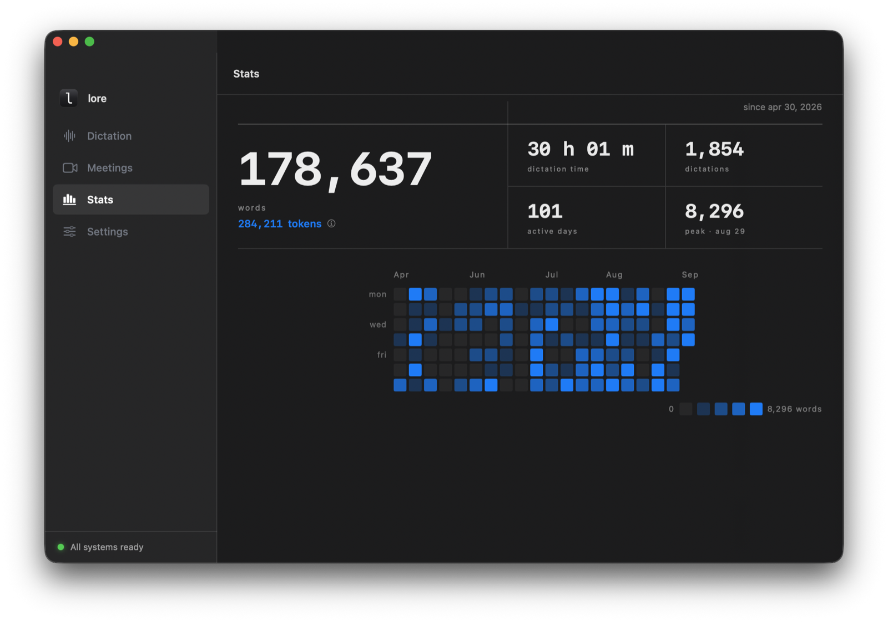
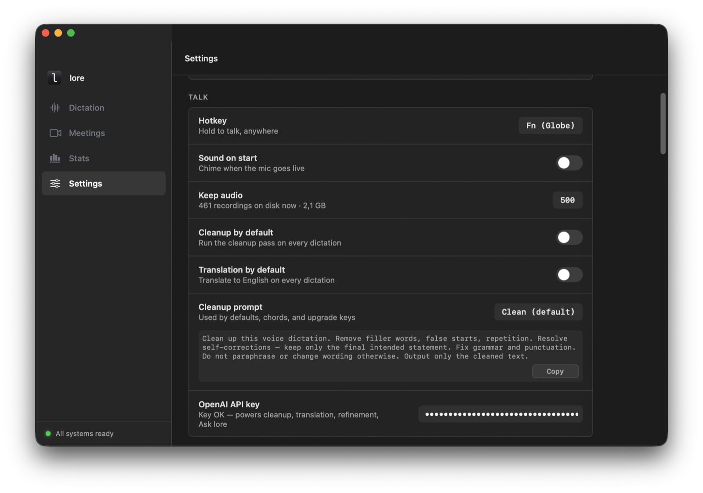
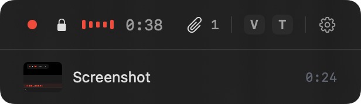
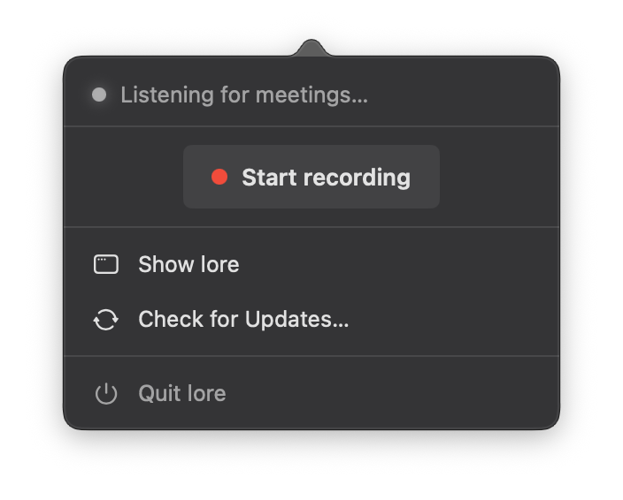

# lore

**Voice input for people who drive coding agents all day.**

Hold `fn`, say it the way it comes out, release. The text shows up at your cursor: in Claude Code, Cursor, a browser, anywhere you can paste. Transcription runs on your Mac. No account, no subscription.


## Why

Agents answer better when you give them the whole picture. Speaking is how you get to the details you would never type: the constraints, the thing you tried, the part that feels wrong. lore is built for that kind of input. Talk for as long as you think, ramble, correct yourself mid-sentence, drop in a screenshot without stopping. Then release, and all of it lands.

## What it does

- **One key.** Hold `fn`, speak, release. Text is pasted at your cursor. lore never presses Enter for you.
- **No time limit.** A dictation runs as long as you keep talking. Lock it with `Space` and put your hands down.
- **Never lost.** The audio is written to disk from the first second. If the app is killed mid-sentence, the dictation is in History at next launch with a Retry.
- **Context without stopping.** While you speak, anything you copy joins the text at the clause you were saying: a screenshot (`fn`+`S`), a link, a snippet, or a file if you switch that on. Terminals and editors get the path, web composers get the file.
- **Clean up only when you ask.** Raw words paste by default. Press `fn`+`V` while recording to clean up on paste (self-corrections resolved, no paraphrasing), `fn`+`T` to translate to English on paste. Both use your own OpenAI key.
- **Any language, or several.** Russian, English, half of each in one sentence. No language switch to set.
- **Kept.** Every dictation stays in History with its text and duration, editable; audio for the last 500. Stats shows your words, time, and a per-day heatmap.
- **Nothing to learn first.** No tutorial. Each feature says one sentence from its own place, the moment you could use it, and then leaves you alone.

## Keys

| Key | What it does |
|---|---|
| `fn` (hold) | Record while held, paste on release |
| `Space` while holding | Lock the recording, hands free |
| `fn`+`Space` while locked | Pause, and resume |
| `Esc` | Cancel without pasting; the dictation goes to History |
| `fn`+`V` while recording | Clean up on paste |
| `fn`+`T` while recording | Translate to English on paste |
| `fn`+`S` while recording | Screenshot into the dictation |
| `fn`+`R` / `fn`+`Q` | Read the selected text aloud / add it to the queue |

If macOS already uses `fn` for something else, onboarding offers Right Option or a key you record yourself.

## Screenshots

| | |
|---|---|
|  |  |
|  |  |

## What it does not do

- Mac only. macOS 15 or later, Apple silicon.
- Text appears on release, not while you speak.
- Names and jargon get guessed. There is no custom dictionary, on purpose; the model on the other end usually knows what you meant.
- Cleanup and translation need an OpenAI key and go to OpenAI. Without a key, raw text pastes.
- Live translation is into English only. Other languages are available afterwards from the History row.
- Not tested with VoiceOver.

## Install

Download [Lore.dmg](https://updates.dev.cognition.design/download/Lore.dmg) (every version is also on the [Releases](https://github.com/atarazevich/lore/releases) page), drag lore to Applications, open it.

First launch asks for three permissions (Microphone, Accessibility, Input Monitoring) and downloads the speech models once, about 930 MB. Then hold `fn`.

New versions appear on the Releases page; the app also offers them from the menu bar, Check for Updates.

## Privacy

Transcription runs on your Mac. Text leaves it only when you ask: dictation cleanup and translation, the live meeting cleanup, and Ask Lore go to OpenAI with your own key; Read aloud sends the selected text to Speechify with your key; a problem report goes to our server only when you press Send, exactly as previewed. The app checks for updates at launch and every six hours (Settings switch) and downloads its speech models once from Hugging Face. No account, no analytics, no cookies. Your data is stored in `~/Library/Application Support/Lore`, the speech models in `~/Library/Application Support/FluidAudio`.

## Also in the app

**Meeting notes.** Record a meeting from the mic and system audio, get a transcript that separates you from the other side, and notes enriched on-device with Apple's models. Recording a conversation is on you: many places require everyone's consent first, and lore leaves that, and the law, in your hands.

**Read aloud.** Select text anywhere, press `fn`+`R`. Speechify voices with your key, or the free system voices.

## Build from source

```bash
cd app && ./build.sh
killall Lore; cp -R .build/debug/Lore.app /Applications/ && open /Applications/Lore.app
```

Needs a full Xcode install and an Apple Development certificate; the script signs the bundle and refuses to build unsigned.

## License

MIT, see [LICENSE](LICENSE). lore started as a fork of OpenOats. Third-party notices are in [THIRD-PARTY-LICENSES.txt](THIRD-PARTY-LICENSES.txt). Speech recognition is NVIDIA Parakeet TDT 0.6B v3 ([CC BY 4.0](https://creativecommons.org/licenses/by/4.0/)) running through [FluidAudio](https://github.com/FluidInference/FluidAudio).
